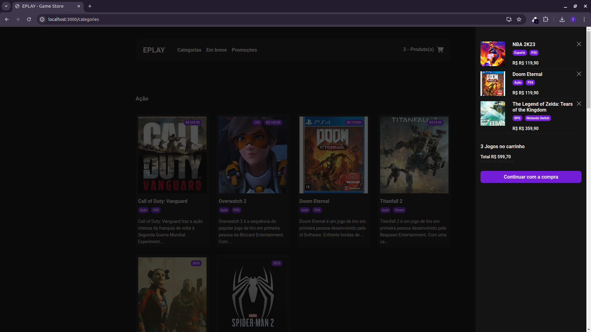
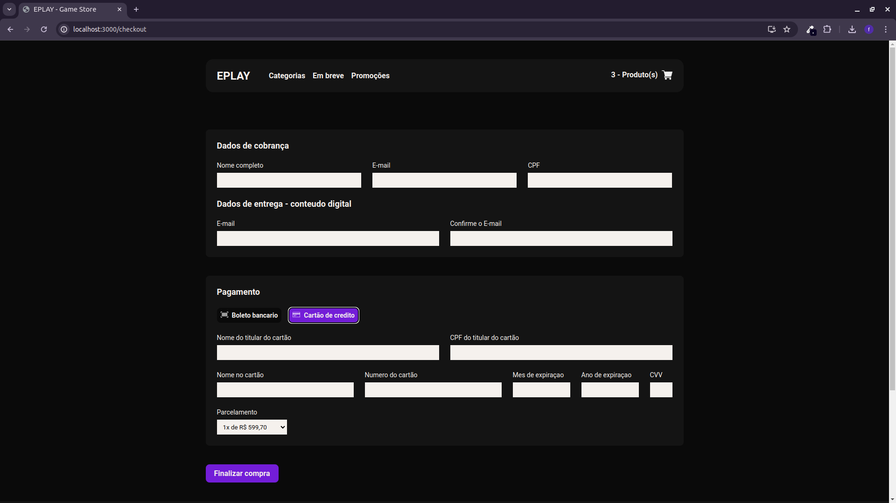

# ePlay

This project was bootstrapped with [Create React App](https://github.com/facebook/create-react-app).

## Description

ePlay is a web application built with React, Redux, TypeScript, and other modern technologies to create a dynamic and responsive user experience

### Installation

1) Clone the repository: git clone https://github.com/fernandohiroshi/eplay-gamestore-ebac.git
2) Navigate to the project directory: cd eplay
3) Install dependencies: npm install
4) Start the application: npm start

### Key Technologies

React
Redux Toolkit
TypeScript
Formik and Yup
React Router DOM
Styled Components
React Spinners

### NPM Scripts

npm start: Starts the development server.
npm build: Builds an optimized production version.
npm test: Runs unit tests.
npm eject: Removes the dependency on react-scripts.

### Folder Structure

components: Reusable React components.
pages: Components representing application pages.
redux: Redux Toolkit configurations.
styles: Global application styles.
utils: Utility functions.
App.tsx: Main application component.
index.tsx: Application entry point.

public: Static files.
node_modules: Project dependencies.

## Development Setup

ESLint
Prettier
Browserslist

[Visit the Live Site](https://eplaygame.vercel.app/)

